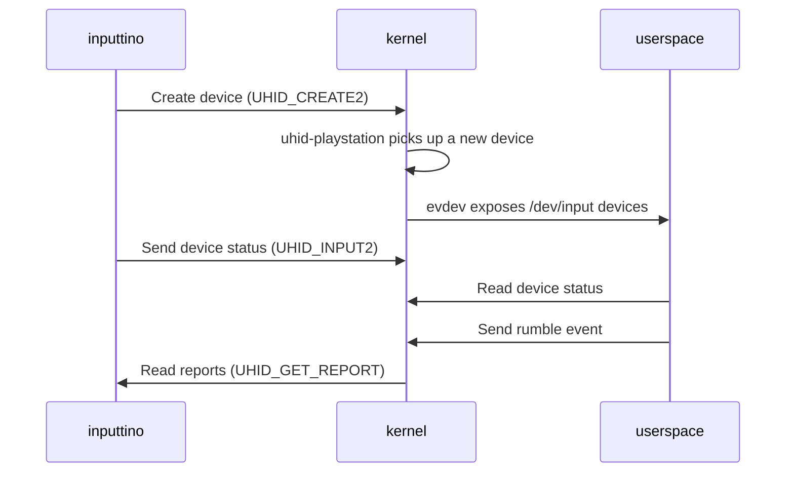

In my [previous post](), we've seen the challenges of creating a virtual PlayStation
controller using uinput.  
While uinput worked well for basic gamepad features, it fell short when trying to replicate the DualSense's more
advanced capabilities like motion sensors and touchpad.  
The solution? Moving down the stack
to [UHID](https://kernel.org/doc/html/latest/hid/uhid.html) (User-space HID): a kernel module that allows us to create virtual USB HID devices.

## UHID

The API exposed by the kernel is quite simple:

- You open up `/dev/uhid` and everything flows there
  as [uhid_event](https://github.com/torvalds/linux/blob/95ec54a420b8f445e04a7ca0ea8deb72c51fe1d3/include/uapi/linux/uhid.h#L171-L198)
- You create a new device by sending a `UHID_CREATE2` event, from there you just `POLL` the `fd` in order to listen for
  events (ex: Rumble, LED) and send back `UHID_INPUT2` to write the current status

Here's a badly drawn diagram to get a high level overview of how it works:



There are two ways to connect a DualSense to a computer: via USB or Bluetooth. I've started with emulating a USB device
because it's easier to implement, we'll see the Bluetooth part later.

## Virtual USB DualSense joypad

Creating a device is quite simple, you just need to send a valid `UHID_CREATE2` event. Here you'll fill the product ID,
vendor ID, and the name of the device. It's important that we match the product ID and vendor ID of the DualSense so
that the kernel can properly recognise it and match it with the right driver (`hid-playstation`).

To control our virtual DualSense joypad we need to send to `uhid` the event `UHID_INPUT2` with a properly formatted
struct so
that then when the kernel (`hid-playstation`) reads it, it can properly parse it. To make my life easier I've made the
following struct:

```c
struct dualsense_input_report_usb {
  uint8_t report_id = 0x01;
  uint8_t x, y = PS5_AXIS_NEUTRAL;   // LS
  uint8_t rx, ry = PS5_AXIS_NEUTRAL; // RS
  uint8_t z, rz = PS5_AXIS_NEUTRAL;  // L2, R2
  uint8_t seq_number = 0;
  // HAT_SWITCH is neutral when 0x8 is reported
  uint8_t buttons[4] = {HAT_NEUTRAL, 0, 0, 0};
  uint8_t reserved[4] = {0, 0, 0, 0};

  /* Motion sensors */
  __le16 gyro[3] = {0, 0, 0};  /* x, y, z */
  __le16 accel[3] = {0, 0, 0}; /* x, y, z */
  __le32 sensor_timestamp = 0;
  uint8_t reserved2 = 0;

  /* Touchpad */
  struct dualsense_touch_point points[2] = {};

  uint8_t reserved3 = 0;
  uint8_t r2_adaptive_trigger = 0;
  uint8_t l2_adaptive_trigger = 0;
  uint8_t reserved4[9] = {};

  uint8_t battery_charge : 4;
  uint8_t battery_status : 4;
  uint8_t battery2 = 0x0c;
  uint8_t reserved6[9] = {};
};
```

Wait, where does that comes from?  

Well luckily someone else reverse engineered the DualSense and shared
the [report structure](https://github.com/nondebug/dualsense). On top of that they've also made
this [awesome web tool](https://nondebug.github.io/dualsense/dualsense-explorer.html) so that you can see your
controller's raw data in real time! I've adapted the struct also based on
the [hid-playstation source](https://github.com/torvalds/linux/blob/305230142ae0637213bf6e04f6d9f10bbcb74af8/drivers/hid/hid-playstation.c#L202-L222)

On the other side, when the kernel wants to send data to the controller, we'll read a `UHID_OUTPUT` event with the
following struct:

```c 
struct dualsense_output_report_usb {
  uint8_t report_id; // 0x02 for USB

  uint8_t valid_flag0; // see enum FLAG0
  uint8_t valid_flag1; // see enum FLAG1

  /* For DualShock 4 compatibility mode. */
  uint8_t motor_right;
  uint8_t motor_left;

  /* Audio controls */
  uint8_t reserved[4];
  uint8_t mute_button_led;

  uint8_t power_save_control;
  uint8_t reserved2[28];

  /* LEDs and lightbar */
  uint8_t valid_flag2; // see enum FLAG2
  uint8_t reserved3[2];
  uint8_t lightbar_setup;
  uint8_t led_brightness;
  uint8_t player_leds;
  uint8_t lightbar_red;
  uint8_t lightbar_green;
  uint8_t lightbar_blue;

  uint8_t reserved4[15];
};
```

(adapted from
the [hid-playstation source](https://github.com/torvalds/linux/blob/305230142ae0637213bf6e04f6d9f10bbcb74af8/drivers/hid/hid-playstation.c#L227-L252))

Apart from a bunch of very specific[^1] [^2] [^3] quirks the rest of the implementation is quite straightforward: just a
mapping between our high level API and the raw values that are expected in those structs.

[^1]: https://github.com/LizardByte/Sunshine/issues/3247#issuecomment-2428065349

[^2]: https://github.com/games-on-whales/inputtino/issues/14

[^3]: https://github.com/torvalds/linux/blob/305230142ae0637213bf6e04f6d9f10bbcb74af8/drivers/hid/hid-playstation.c#L1409-L1410

## Does it work?


It does! 🎉  
Steam properly recognises it as a DualSense joypad, you can see the right glyphs and even Gyro, Acceleration and
touchpad are all working.

After merging and releasing this to [Wolf](https://github.com/games-on-whales/wolf) and [Sunshine](https://github.com/LizardByte/Sunshine), we've got some weird issues [^4] [^5] reported by users: it seems that our virtual DualSense is not being recognised by some games. Ultimately, it seems that only when Steam Input is enabled the controller is properly recognised.  

When I first tested my implementation using SDL2, I've noticed that some of the more advanced features like touchpad and LED were not recognised..  
If you remember from the previous post, we've mentioned that when plugging a real DualSense SDL2 would use the `hidapi` driver to communicate with the controller. With this implementation that driver is still failing and SDL falls back to the `sysjoystick` driver.

Why is it working on some games and not on others? Why is Steam correctly recognising it?


Buckle up! In the next post we'll go back to dive into the depths of SDL to understand what's going on!

[^4]: https://github.com/LizardByte/Sunshine/issues/3468
[^5]: https://github.com/games-on-whales/inputtino/issues/16
