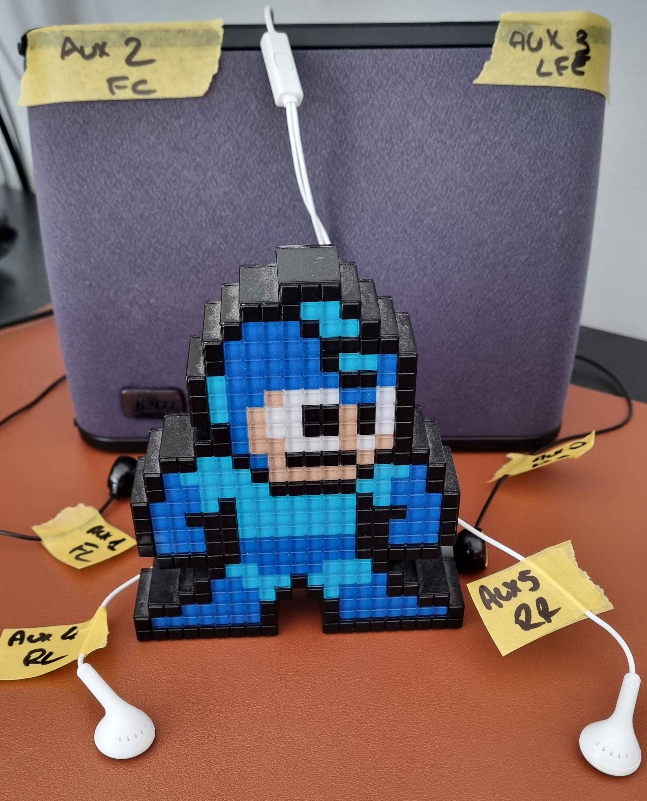

It all started when https://github.com/shocklateboy92[@shocklateboy92] asked me if I could add support for surround in https://github.com/games-on-whales/wolf[Wolf].
I don't have a surround system, so I was under the impression that I couldn't test that without buying one. +
Until this message:

[quote,@shocklateboy92]
You can probably test locally by plugging 3 sets of headphones in.

That can't be right, my motherboard jack audio only outputs two channels, right?

[quote,@shocklateboy92]
Before HDMI, we did surround sound setups with 3.5mm audio jacks.
The line-out/mic jacks become the second and third sets of channels.

Wait, what?
After a bunch of tests, it turns out that he's right, behold the following monstrosity:

.Not pictured: the 3 headphones are plugged at the back of the motherboard in the line-out, line-in, and mic jacks.

Unfortunately, this is what I had lying around in forgotten drawers.
I wouldn't recommend this setup for high quality movies or music, unless you have 6 ears connected to your brain.

== Pipewire setup

The first step is on Pipewire to create a virtual sink that supports 5.1 surround with the following config file (adapted from https://gitlab.freedesktop.org/pipewire/pipewire/-/wikis/Virtual-Devices#virtual-devices[the pipewire wiki]):

`~/.config/pipewire/pipewire.conf.d/virtual-5.1.conf`

[source]
....
context.objects = [
   {   factory = adapter
       args = {  
           factory.name=support.null-audio-sink
           node.name=hrir-headphones  
           media.class=Audio/Sink  
           object.linger=1  
           audio.position=[ FL FR FC LFE RL RR ]
           monitor.passthrough=true  
           }
   }
]
....

and restarted Pipewire to apply the changes.

Now we have a virtual sink that supports 5.1 surround, but how do we use it?
I've used a brilliant GUI for that: https://github.com/rncbc/qpwgraph[qpwgraph]. +
On one side I've connected the Moonlight audio channel to the virtual sink, and on the other side, I've connected the virtual sink to the AUX outputs available.
The result is something like this:

.Mapping is straightforward, for my sanity I've taped the headphones with the expected output channel name.

To test each channel individually, I've then used the samples available at https://www2.iis.fraunhofer.de/AAC/multichannel.html[].

With this setup, I was able to compare the output of locally playing the source audio files via Firefox vs what Wolf was streaming to Moonlight and fully implement surround support without buying expensive hardware!
